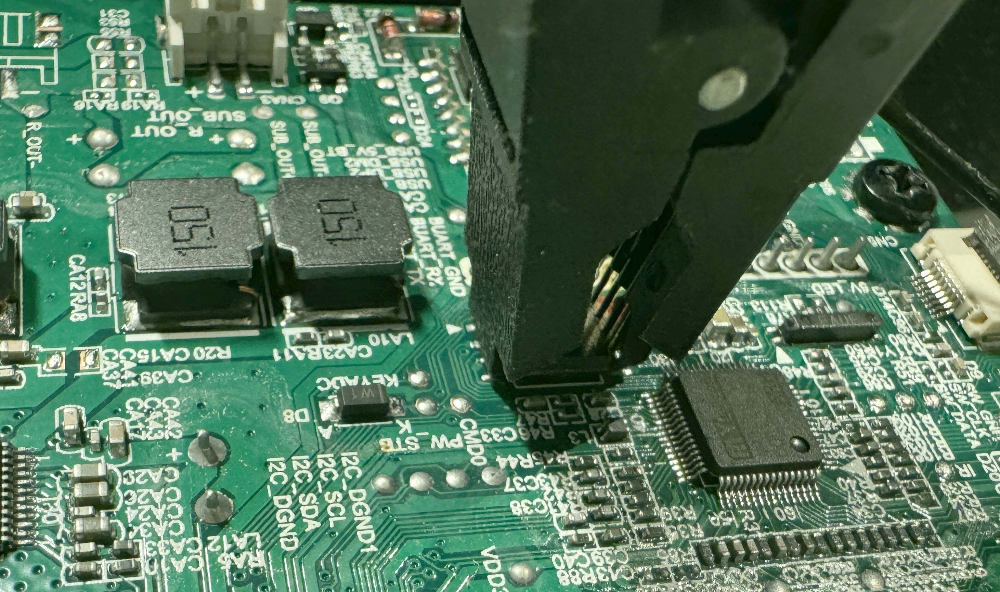

# Linkplay A31 WiFi audio streaming module

## Preamble

The [Linkplay A31](https://www.linkplay.com/modules) is a WiFi audio streaming module
(System on Module, SoM) developed to be used in wireless speakers and wireless audio systems.
The module seems to be sold under [many different names](https://github.com/nagyrobi/home-assistant-custom-components-linkplay#about-linkplay)
([Rakoit](https://www.rakoit.com/product/wifi-module-a31/), Wiimu).

Because the module itself does not have a DAC and amplifier,
it is typically connected to another board in many consumer products.
For example, in the [DYON Area L WiFi speaker](https://www.dyon.eu/portfolio/dyon-area-lautsprecher/)
it is connected to an C.AP8064.05 amplifier board
([PCB back](c-ap8064-05-amp-pcb-back.jpg), [PCB front with serial cable attached to the A31](c-ap8064-05-amp-pcb-front.jpg),
[MVsilicon AP8064 MCU datasheet](https://www.diyaudio.com/community/attachments/ap8064_datasheet_v1-2-pdf.1145388/)).

The aim of this project is to replace the vendor firmware by an open source solution.
With the following instructions you can install an [OpenWrt](https://openwrt.org/) system
with network streaming capabilities for [Apple](https://apple.com)
[Airplay](https://en.wikipedia.org/wiki/AirPlay) devices.

Please do me a favor: :thumbsup: If you use any information or code you find here, please link back to this page.
:star: Also, please consider to star this project. I really like to keep track of who is using this to do creative things, especially if you are from other parts of the world.
:smiley: You are welcome to open an issue to report on your personal success project and share it with others.


## Hardware

The Linkplay A31 V04 module ([PCB front](linkplay-a31-pcb-front.jpg), [datasheet](https://fcc.report/FCC-ID/2AAPP-A31/3034717.pdf))
is based on a MediaTek MT7688AN MCU (32-bit MIPS 24KEc) with 64MB RAM and 16MB W25Q128 SPI NOR flash.
The module offers pins for I2S, I2C, ethernet, USB, UART and 5 GPIOs.

The module has an undocumented serial port used as Linux console ttyS1
([RX/TX pins next to the WiFi antenna](linkplay-a31-serial-port.jpg),
[full PCB](c-ap8064-05-amp-pcb-front.jpg)).
The serial port works with 5V (not 3V3) and 57600 8N1.


## Software

### Vendor firmware

The module uses a patched version of U-Boot 1.1.3 (Ralink UBoot Version 4.3.0.0),
a (MediaTek SDK) patched Linux kernel 2.6.36 and
a weird combination of proprietary and OSS/GNU operating system components.

Other users thankfully have comprehensivly analysed the system and vendor application layer:
[Crymeiriver started reverse engineering some years ago](https://github.com/Crymeiriver/LS150),
[Jan21493 added a ton of more information](https://github.com/Jan21493/Linkplay) and
[AndersFluur wrote an inofficial API documentation](https://github.com/AndersFluur/LinkPlayApi).


### Linux kernel support

[mt7628an_linkplay_a31.dts](openwrt-linkplay-a31/mt7628an_linkplay_a31.dts) is a
[Device Tree Source file](https://en.wikipedia.org/wiki/Devicetree)
which describes the hardware components of the Linkplay A31 WiFi module.

The DTS configures the A31 as an I2S slave (see A31 manual section 2.3) using a generic S/PDIF transmitter.
For I2S master configuration, you'll need to add a real codec,
see DTS files of other boards if needed.

Original firmware has a 'firmware' partition with size 0x730000 at 0x250000,
a jffs2 'user' partitition with size 0x80000 at 0x980000 and
a jffs2 'user2' partition with size 0x600000 at 0xa00000.
The DTS drops both user partitions in favour of a bigger 'firmware' partition
(writeable, with [OverlayFS](https://openwrt.org/docs/techref/flash.layout#partitioning_of_nor_flash-based_devices)).

The WiFi module GPIOs 1-5 (PCB pins 23, 22, 27, 26, 19) are wired
to MT7688AN pins 14-18, one can access them from Linux via
GPIOs 494 (GPIO2), 495 (GPIO1), 496 (GPIO4), 497 (GPIO3) and 498 (GPIO5).


### OpenWrt

#### Compiling

Make sure to read the general OpenWrt docs
[here](https://openwrt.org/docs/guide-developer/toolchain/start) and
[here](https://openwrt.org/docs/guide-developer/toolchain/use-buildsystem)
and at least [install the necessary build packages](https://openwrt.org/docs/guide-developer/toolchain/install-buildsystem#debianubuntumint).

Then proceed like this:

```
git clone https://github.com/hn/linkplay-a31.git
git clone https://git.openwrt.org/openwrt/openwrt.git
cd openwrt
git checkout v23.05.3
./scripts/feeds update -a
./scripts/feeds install -a
../linkplay-a31/openwrt-linkplay-a31/prepare-openwrt-a31.sh
# edit 'files/etc/config/wireless' and set your WiFi credentials
make -j$(nproc) defconfig download clean world
```

Output images are found in `./bin/targets/ramips/mt76x8`.

The script includes a patch which works around 
[the MT7688 from crashing the entire system when I2S audio playback is stopped manually](openwrt-linkplay-a31/836-mt7688-i2s-audio-crash-workaround.patch).

#### Testing

The OpenWrt image can easily be tested _without_ writing anything to flash
(no permanent modifications).
You can use [self-compiled packages](#compiling) or 
[packages provided by this project](openwrt-ramips-mt76x8-linkplay_a31-initramfs-kernel.bin).

Install Kermit (`apt-get install ckermit`),
connect the [serial console of the A31](#hardware)
and execute `../linkplay-a31/linkplay-a31-serial-upload-kermit`
(change `port /dev/ttyUSB0` if necessary).
Reset (e.g. powercycle) the A31.
The Kermit script will interrupt the A31 boot process,
upload the `openwrt-ramips-mt76x8-linkplay_a31-initramfs-kernel.bin` image
via `loadb` and boot the system from RAM (`bootm`).
Be patient, the serial upload will take roughly 20-25 minutes to finish.

You might want to edit `/etc/config/wireless` within the
test system (followed by `wifi reconf`) to set your WiFi credentials.

The image contains the package `shairport-sync-mini` and
therefore you can use an Apple device to stream music to it.
Alternativly, you can use `aplay` for wav-files or `mpg123`
for music streams (non-ssl only). Do not download large files
to the system, space is extremely limited.

With `fw_printenv` one can list the NVRAM contents of the vendor firmware
(config [fw_env.config](openwrt-linkplay-a31/files/etc/fw_env.config)).

#### Installing

There exist various documents on how to backup and flash OpenWrt devices.
It might even be possible to upload the OpenWrt `sysupgrade.bin` via the
vendor's firmware update web interface, but this has not been tested
at all.

:warning: Warning: Make a backup of the flash content before
overwriting it. No need to say that flashing will void the warranty.

:warning: Warning: Take extra care when flashing, especially
make sure not to overwrite the U-Boot bootloader, this will
brick your device.

:raised_hand: [Flash memory has a limited number of write cycles](https://en.wikipedia.org/wiki/Flash_memory#Memory_wear).
Avoid unnecessary system upgrades or writing large files
(always use [tmpfs](https://en.wikipedia.org/wiki/Tmpfs) in /tmp if possible).

It is recommended to [boot the system via serial](#testing) and
flash the image from within the running system with

```
mtd -r write /tmp/openwrt-ramips-mt76x8-linkplay_a31-squashfs-sysupgrade.bin firmware
```

Make sure that the time of the newly installed system is correct, otherwise you won't be able to download HTTPS content due to certificate validity problems.

:bulb: The system sets up a [rescue access point](openwrt-linkplay-a31/files/etc/init.d/rescue-ap)
if there is no WiFi connectivity (e.g. wrong credentials) three minutes after booting.
The SSID is `LINKPLAY` and [passphrase](openwrt-linkplay-a31/files/etc/hostapd-rescue.conf) is `A31A31A31`.
IP address for SSH connection is `192.168.31.1` (no DHCP server, you have to set IP manually on your client).
After 10 minutes of inactivity the rescue access point will be shut down (sytem reboot).

#### Additional software

The flash space of the A31 module is extremely limited.
Therefore the [OpenWrt config](openwrt-linkplay-a31/defconfig) includes only a minimal set of software packages (e.g. no web interface).
After installation, you (only) have roughly 6 MB of free space available.

While it is possible to install additional software, many packages (e.g. [gmrender-resurrect](https://github.com/hosac/openwrt-feed-gmediarender), OwnTone, ...) depend on Gstreamer and FFmpeg libraries, which are way to big to be installed on the module.

I suggest to install [mpd-mini](https://openwrt.org/packages/pkgdata/mpd-mini) (config [diff here](openwrt-linkplay-a31/mpd-config.diff), and you have to add user 'mpd' to the 'audio' group).
HTTPS-streams seem to overload the cpu and tend to be unstable.


### Amplifier control app

The Linkplay A31 does not have a DAC and amplifier, so it
is necessary to control volume and mute status via
serial commands (e.g. `AXX+VOL+007`, sent via `ttyS0 57600 8N1`
to the amp board).

Audio is [not always that straightforward with Linux](https://hacktivis.me/articles/linux-audio-output),
so this project uses a possibly confusing (some might call it clever)
[ALSA](https://www.alsa-project.org/) setup to control the amplifier status:

- The I2S S/PDIF output device does not have a mixer, so client programs
  (e.g. shairport-sync) would not be able to control the volume.
- Therefore a Linux dummy sound device (with dummy mixer) is activated (`kmod-sound-dummy`).
- With a [specially crafted asound.conf](openwrt-linkplay-a31/files/etc/asound.conf),
  default audio output is routed to the I2S device (the amp board accepts audio format S16, rate 44,100 Hz)
  and default audio control is routed to the dummy device (mixer).
  Client programs happily change the volume of the dummy mixer,
  but the real audio data is passed unchanged (volume 100%) to the amplifier board
  (assuming that the client program itself does no software mixing,
  it is recommended to disable any client volume/mixer processing).
- A [Linkplay Emulator Daemon](openwrt-linkplay-a31/linkplay-emu/src/linkplay-emu.c)
  is installed to monitor both devices and send serial control commands
  to the amplifier board when sound is played or the volume changes.

The terms 'emulator' and 'daemon' are a bit exaggerated, the code only
emulates three serial commands and does not daemonize itself,
but hey, it works :)


# C.AP8064.05 amplifier board

The DYON Area L WiFi speaker plays a particularly annoying
welcome message ("Geniesse WiFi Musik" in german) when you
switch to the Airplay source (`AXX+PLM+001`).
This message is _not_ stored on the A31 module but on the amp board.

Since it was not possible to stop this dumb behavior via serial commands,
a more stringent solution had to be found.

The firmware of the MVsilicon AP8064 MCU is stored in a 4MB GD25Q32 SPI NOR
flash which can be [read with a SOIC-8 clip](https://www.flashrom.org) like this:



Haven't looked closely, but the dump doesn't seem to contain a known
kernel or file system, everything appears to be proprietary.

By examining the dump more carefully one sees that there is some
kind of 'table of contents' represented by text-offset-length values
at flash position `0x100000`:

```
ToC 01, Signature: WIFI, Offset: 100bfd, Length:  32f8
ToC 02, Signature: USB_, Offset: 103ef5, Length:  2c9c
ToC 03, Signature: WTCN, Offset: 106b91, Length:  2e9c
ToC 04, Signature: AUX_, Offset: 109a2d, Length:  316d
ToC 05, Signature: CARD, Offset: 10cb9a, Length:  2de1
ToC 06, Signature: FMRD, Offset: 10f97b, Length:  2442
ToC 07, Signature: CNND, Offset: 111dbd, Length:  1d07
...
ToC 29, Signature: 3DFF, Offset: 13fd41, Length:  b36c
ToC 30, Signature: WIfi, Offset: 14b0ad, Length: 1631a
ToC 31, Signature: Aux_, Offset: 1613c7, Length: 15f05
ToC 32, Signature: CNnd, Offset: 1772cc, Length:  c800
ToC 33, Signature: CNlt, Offset: 183acc, Length: 1094e
ToC 34, Signature: LWbt, Offset: 19441a, Length: 22b1a
ToC 35, Signature: CHrg, Offset: 1b6f34, Length:  b398
ToC 36, Signature: PWou, Offset: 1c22cc, Length: 121cc
ToC 37, Signature: WTcn, Offset: 1d4498, Length: 17399
ToC 38, Signature: FMup, Offset: 1eb831, Length:  af83
```

If you extract the data, you exactly get 38 valid MP3 files with
audio data for all types of events ('Charging', 'Connection lost' etc.).

The annoying WiFi connection message is stored in ToC 30 (Signature `WIfi`) for
german audio and in ToC 01 (Signature `WIFI`) for english audio.

The fix is to change the `WIfi` signature to something meaningless (`FOOO`)
in the ToC and flash the modified image file back to the flash chip
(only 4 bytes changed compared to the vendor image).
The amplifier driver then will not be able to find the audio
data and ... you will _really_ be able to enjoy WiFi music _undisturbed_ :)

